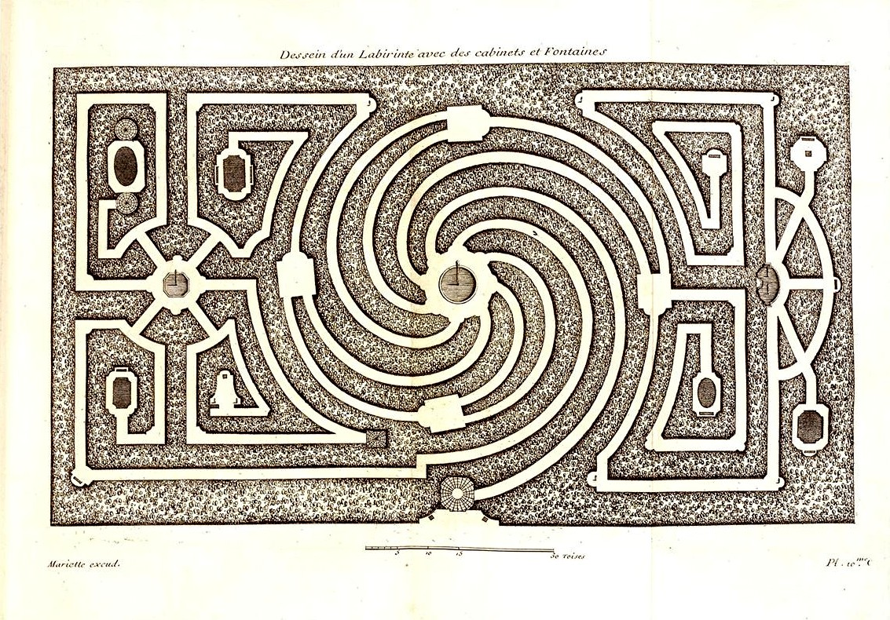

```xml
<dependency>
  <groupId>io.lacuna</groupId>
  <artifactId>bifurcan</artifactId>
  <version>0.2.0-alpha4</version>
</dependency>
```

This library provides high-quality Java implementations of mutable and immutable data structures, each sharing a common API and these design principles:

* efficient random access
* efficient inverted indices (all collections other than lists provide an `indexOf` method)
* efficient splitting and merging of collections
* customizable equality semantics
* contiguous memory used wherever possible
* performance equivalent to, or better than, existing alternatives
* changes to a collection can be tracked in a **diff** data structure, which can be subsequently rebased onto a different collection
* [ALPHA] durable (disk-backed) representations which share the API and asymptotic performance of their in-memory counterparts

Rather than using the existing collection interfaces in `java.util` such as `List` or `Map`, it provides its own interfaces (`IList`, `IMap`, `ISet`) that provide functional semantics - each update to a collection returns a reference to a new collection.  Each interface provides a method (`toList`, `toMap`, `toSet`) for coercing the collection to a read-only version of the standard Java interfaces.

### what makes this better?

Some aspects of this library, like the inverted indices, diffs, and durable collections, are unique.  

There are, however, many existing implementations of "functional" (aka persistent, immutable) data structures on the JVM.  As shown in [these in-depth comparisons](https://github.com/lacuna/bifurcan/blob/master/doc/comparison.md), Bifurcan's performance is equivalent to the best existing implementations for basic operations, and significantly better for batch operations such as `union`, `intersection`, and `difference`.

These optimized batch operations [require a high degree of complexity](https://github.com/lacuna/bifurcan/blob/29cb1efa4e561312ed7678a03c5ccedafc56e47d/src/io/lacuna/bifurcan/nodes/IntMapNodes.java#L665-L923) and are difficult to test, so it's understandable other library authors haven't bothered.  Bifurcan relies on [extensive generative tests](https://github.com/lacuna/bifurcan/blob/29cb1efa4e561312ed7678a03c5ccedafc56e47d/test/bifurcan/collection_test.clj) to validate its implementation, which makes this additional complexity easier to manage.

### collections

* [LinearMap](http://lacuna.io/docs/bifurcan/io/lacuna/bifurcan/LinearMap.html) is a mutable hash-map, which allows for custom hash and equality semantics.  It stores entries contiguously in memory, which means that iteration over the entries can be [20x faster](https://github.com/lacuna/bifurcan/raw/master/benchmarks/images/map_iterate.png) than `java.util.HashMap` for larger collections.
* [Map](http://lacuna.io/docs/bifurcan/io/lacuna/bifurcan/Map.html) is an immutable hash-map, which also allows for custom hash and equality semantics.  It ensures that all equivalent collections have an equivalent layout in memory, which makes checking for equality and performing set operations (`merge`, `union`, `difference`, `intersection`) significantly faster.
* [LinearSet](http://lacuna.io/docs/bifurcan/io/lacuna/bifurcan/LinearSet.html) and [Set](http://lacuna.io/docs/bifurcan/io/lacuna/bifurcan/Set.html) are built atop their respective map implementations, and have similar properties.
* [LinearList](http://lacuna.io/docs/bifurcan/io/lacuna/bifurcan/LinearList.html) is a mutable list, which allows for elements to be added or removed from both ends of the collection, and allows random reads and writes within the list.
* [List](http://lacuna.io/docs/bifurcan/io/lacuna/bifurcan/List.html) is an immutable list, which also allows for modification at both ends, as well as random reads and writes.  Due to its [relaxed radix structure](https://infoscience.epfl.ch/record/169879/files/RMTrees.pdf), it also allows for near constant-time slices and concatenation.
* [SortedMap](http://lacuna.io/docs/bifurcan/io/lacuna/bifurcan/SortedMap.html) is an immutable sorted map, built with a red-black tree.
* [IntMap](http://lacuna.io/docs/bifurcan/io/lacuna/bifurcan/IntMap.html) is an immutable sorted map of integers onto arbitrary values, and can be used as an efficient sparse vector.  [FloatMap](http://lacuna.io/docs/bifurcan/io/lacuna/bifurcan/FloatMap.html) provides similar functionality for floating-point keys.
* [Rope](http://lacuna.io/docs/bifurcan/io/lacuna/bifurcan/Rope.html) is an immutable tree-based sequence of Unicode characters.  Unlike Java's `String`, it uses UTF-8 encoding and can efficiently index via both full code points and Java's preferred UTF-16 code units.
* [Graph](http://lacuna.io/docs/bifurcan/io/lacuna/bifurcan/Graph.html), [DirectedGraph](http://lacuna.io/docs/bifurcan/io/lacuna/bifurcan/DirectedGraph.html), and [DirectedAcyclicGraph](http://lacuna.io/docs/bifurcan/io/lacuna/bifurcan/DirectedAcyclicGraph.html) implementations, which provide immutable graph data structures.

Full documentation can be [found here](http://lacuna.io/docs/bifurcan/io/lacuna/bifurcan/package-summary.html).

### 'linear' and 'forked' collections

If we pass a mutable data structure into a function, we have to know what that function intends to do with it.  If it updates the data structure, we cannot safely read from it afterwards.  If it stores the data structure, we cannot safely write to it afterwards.  In other words, to use a mutable data structure safely we must ensure it has a single owner.  Enforcing this may require us to hold a large amount of code in our head at once.

Immutable data structures free us from having to care.  Functions can update or hold onto data without any risks.  We can reason locally about the flow of data, without any care for what the rest of the code is doing.  This can be enormously freeing.

This freedom, however, comes at a cost.  Updates to immutable data structures require a subset of the structure to be copied, which is much more expensive than simply overwriting existing memory.

If a data structure is referenced in multiple places, this is usually a cost worth paying.  In this case, however, it's just wasteful:

```java
Set<Long> set = new Set<>();
for (int i = 0; i < 1000; i++) {
  set = set.add(i);
}
```

This will create 999 intermediate copies of the set, none of which we care about.  There is only a single reference to these copies, and each is discarded as soon as `add()` is called.  The dataflow of these calls form a simple, linear chain.  To have more than one reference, the dataflow must diverge.

Where the dataflow is linear, we can safely use mutable collections.  Where it is not, we prefer to use immutable collections.  Since this linear flow is a local property, we would also like mutability to be a local property:

```java
Set<Long> set = new Set<>().linear();
for (int i = 0; i < 1000; i++) {
  set.add(i);
}
set = set.forked();
```

The call to `linear()` indicates that the collection has a single owner, and may be updated in-place.  The call to `forked()` indicates that this is no longer true.  By allowing temporary mutability, we gain huge performance benefits.  There is still a cost, however, relative to purely mutable data structures.  For this reason, Bifurcan provides permanently linear variants of each collection:

```java
LinearSet<Long> set = new LinearSet<>();
for (int i = 0; i < 1000; i++) {
  set.add(i);
}
```

If we call `forked()` on this collection, it will be wrapped in a **diff** facade, which is described below.

### virtual collections

Bifurcan offers a variety of collection implementations, but you can also create your own by implementing a handful of methods.

A list, at its base, is just a `size` and a function that, given an index, returns the corresponding element.  This can be constructed using the `Lists.from` method:

```java
IList<Long> list = Lists.from(1_000_000, i -> i);
```

This creates a list of the numbers within `[0, 1e6)` without any of the elements being stored in memory.  All of the other operations associated with lists (adding and removing elements, updating elements, concatenating other lists, and so on) have efficient default implementations, which will be discussed in the next section.

An unsorted set is just a list of elements, plus a function that, given an value, returns an `OptionalLong` describing the index of that element:

```java
Function<Long, OptionalLong> indexOf = n -> (0 <= n && n < list.size()) ? OptionalLong.of(i) : OptionalLong.empty();

ISet<Long> set = Sets.from(list, indexOf)
```

A sorted set, conversely, is a list of elements, a comparator, and a function that, given a value, returns an `OptionalLong` describing the index of the closest element which equal to or less than that value (referred to as the "floor index"):

```java
Function<Double, OptionalLong> floorIndexOf = n -> indexOf.apply((long) n);

ISet<Double> sortedSet = Sets.from(list, Comparator.naturalOrder(), floorIndexOf);
```

Sorted and unsorted maps are just their corresponding sets, plus a function from key to value.  These can be constructed using `Maps.from`, or by calling `zip` on a set:

```java
IMap<Long, Double> squareRoots = set.zip(n -> Math.sqrt(n))
```

### diffs

These virtual collections can be modified just like any other Bifurcan collection:

```java
Lists.from(1, x -> 1).addLast(42)
// [1, 42]
```

This is made possible by [diffs](https://lacuna.io/docs/bifurcan/io/lacuna/bifurcan/IDiff.html), which track changes on an immutable **underlying** collection.  Diff implementations exists for all variants of Bifurcan collections, and share the asymptotic performance of their normal counterparts.  By calling `diff()` on any collection, we create a diff wrapper whose changes can then be **rebased** onto a new underlying collection:

```java
IList<Integer> numDiff = List.of(1, 2, 3).diff().removeFirst().addLast(42)
// [2, 3, 42]

IList<Integer> rebased = numDiffs.rebase(List.of(4, 5, 6))
// [5, 6, 42]
```

### durable collections

All in-memory structures can be also saved to disk, while retaining the same API and asymptotic performance.  These durable collections are optimized for reads and batched writes, which means they are not a replacement for general-purpose databases, but they are still [useful in a variety of applications](doc/durable.md).

### no lazy collections

Most libraries for "functional programming" provide a lazy list or stream construct, but this is less a data structure than a mechanism for control flow.  While useful, such a mechanism is out of scope for this library.

### splitting and merging

Many modern data structure libraries also provide "parallel" collections, which make it easy to use multiple cores to process a single data structure.  These collections, however, are simply normal data structures with an execution model bolted on, without any obvious way to disentangle the two.

Rather than provide its own execution model, Bifurcan allows any collection to split into sub-collections using `split(k)`, which will return approximately `k` pieces, depending on its size.  The sub-collections can be processed and then merged using methods such as `concat`, `merge`, `union`, `intersection`, or `difference`.

This separation of concerns provides greater flexibility, but also requires more work to get up and running.

### license

Copyright © 2016-2020 Zachary Tellman

Distributed under the MIT License
