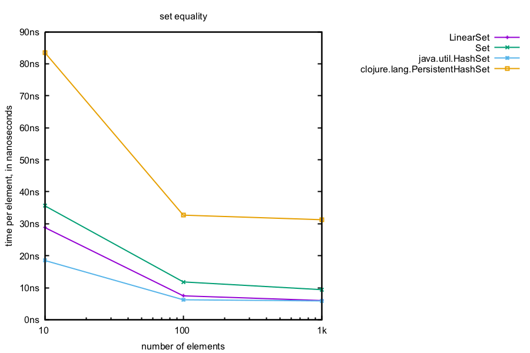

These benchmarks are generated using [Criterium](https://github.com/hugoduncan/criterium), which provides a median value based on repeated trials.  These measurements are isolated from the effects of JIT or GC.

The numbers given here are scaled by the size of the collection, because otherwise the most noticeable feature of these benchmarks would be "larger collections take longer to create/iterate/etc".  This means, however, that the numbers provided here are the mean duration of the median sample, and do not reflect the variation that might be seen in real-world usage.

With that said, this is still as useful as pretty much any other data structure benchmark.  The single largest factor in the performance of any in-memory data structure is whether it's in the cache, and the repeated operations of a benchmark guarantee a warm cache.  This may reflect some real-world workloads, but not others.  The performance for 1OOk+ element collections, which are too big to fit in cache, give some hint as to the effects of a cold cache, but also reflect the other costs of a larger collection.

---

Unlike Java's `HashMap` and `HashSet`, Bifurcan's `LinearMap` and `LinearSet` store their entries contiguously, which means that they can be cloned using `System.arraycopy()`.  This makes iteration over thes data structures significantly faster, as seen below.

## Lists

Unlike Clojure and Java's lists, Bifurcan's lists can efficiently remove and add from both ends of the collection.

Bifurcan's `List` provides equivalent performance in iteration and random lookups to Clojure's vector, but unlike Clojure it also   allows for near constant-time slices and concats.

## Maps

Due to its contiguous layout, `LinearMap` is significantly faster at iteration.  `Map` is about 2x faster than Clojure's `PersistentHashMap` because of a contiguous layout within each node, and `IntMap` is somewhat slower due to the fact that it does an in-order traversal of entries.

The difference between the immutable data structures is largely due to Clojure's custom equality semantics, which can add significant overhead.  As the collections grow larger, this difference is overwhelmed by the cost of lookups in main memory.

These set operations are performed on two data structures of the same type, whose entries half overlap.  Both `Map` and `IntMap` perform these operations structurally, meaning that the more dissimilar the two collections are, the faster the operation.  Even if the two collections overlap completely, these are still expected to be significantly than the Clojure equivalent, which modify the collections one element at a time.

Equality checks are benchmarked by taking two identical collections, and then altering a single, random element for each benchmark run.  Discovering the collections are not equal should require, on average, examining half of the elements.

However, both `Map` and `IntMap` also use their structure to perform equality checks.  If any node's distribution of entries or children differs, it can short-circuit and immediately return false.  

## Sets

The behavior for sets broadly mirrors that of the maps.

