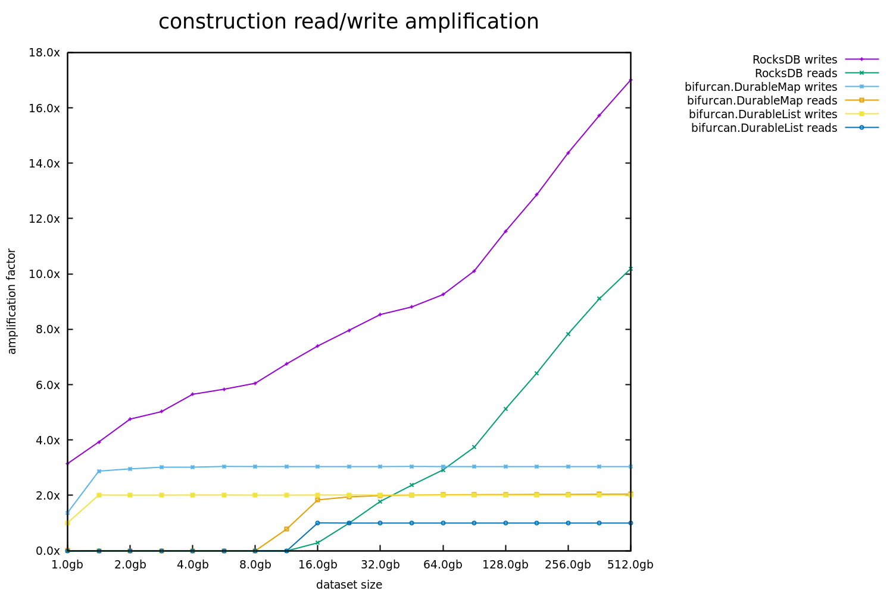
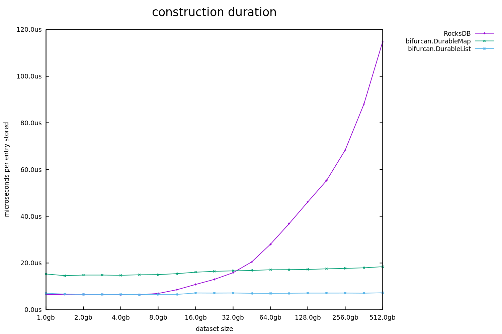
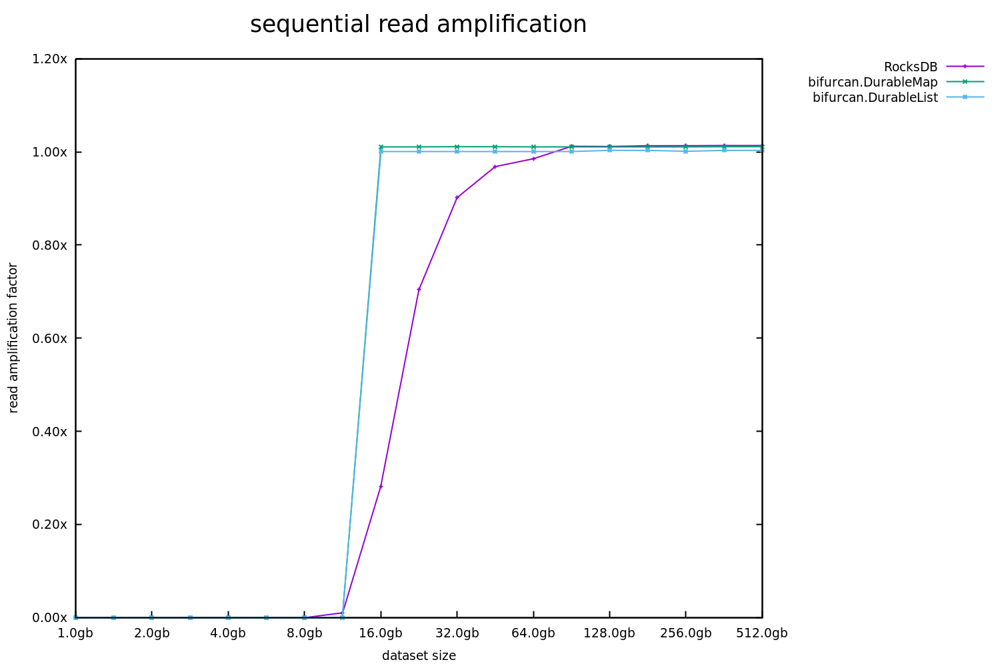
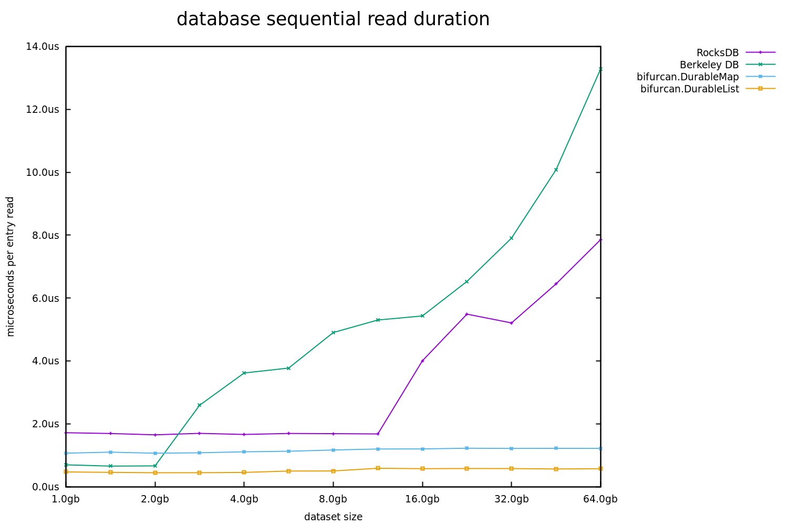
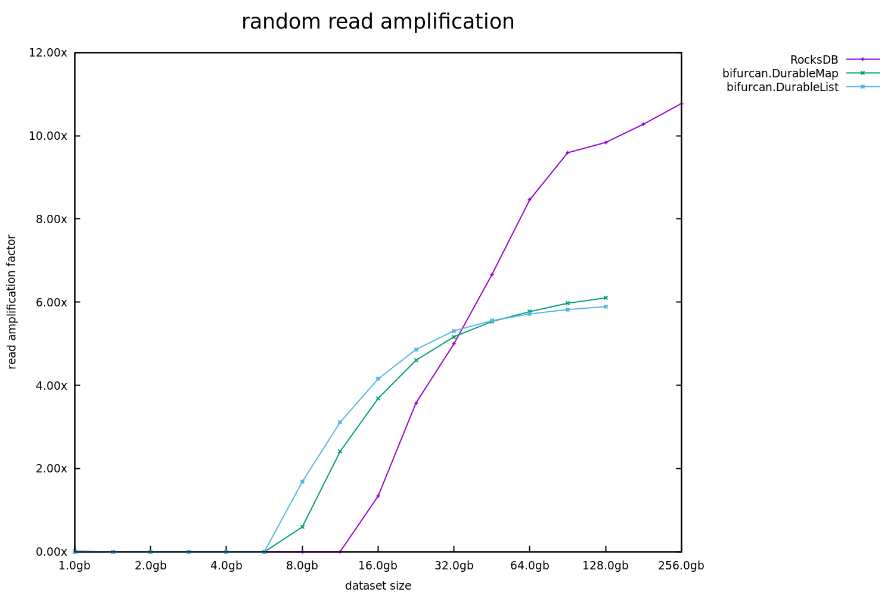
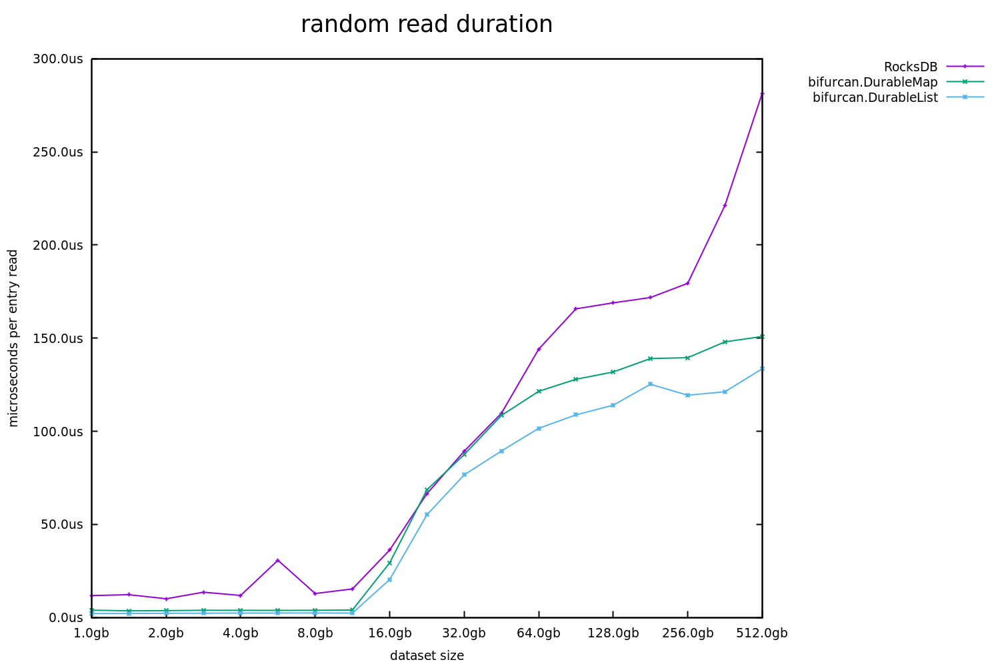
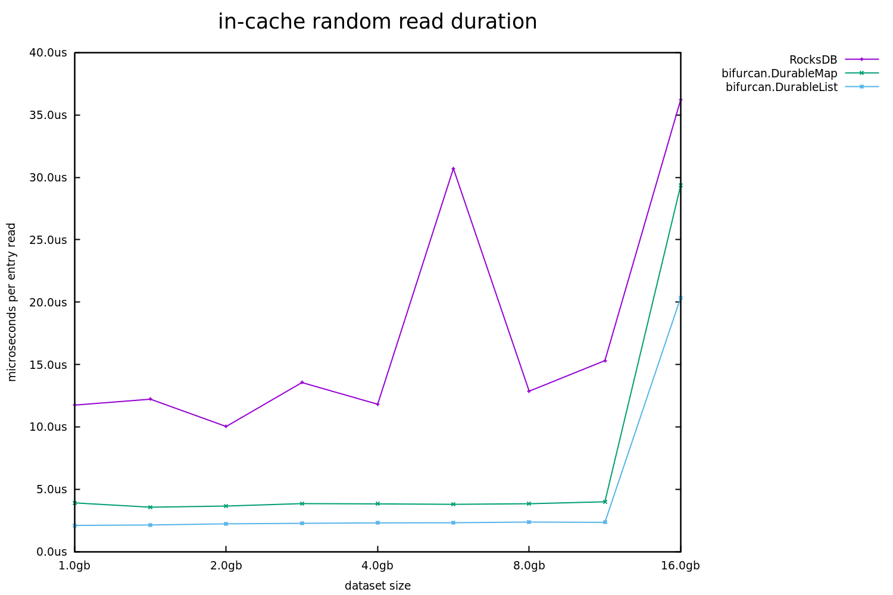

# durable collections

## expanding the frontiers of small data

There's an urban legend, told by software consultants, which begins with a worried client.

"We've got *Big Data*," says the client.  "It's making everything fall over.  Are you sure you can handle it?"

The consultant makes the right soothing sounds, mentions the latest technologies, and eventually a contract is signed.  When the consultant arrives on the first day, the client hands them a plastic flash drive, the kind you'd give away by the dozens at a recruiting booth.  It couldn't hold more than a few gigabytes.

"Here's the data," says the client.  "Good luck."

---

In practice, "big data" is anything that can't be handled by your existing tools on a single machine.  If you use Excel, anything [larger than a million rows](https://support.office.com/en-us/article/excel-specifications-and-limits-1672b34d-7043-467e-8e27-269d656771c3) is big data.  If you use Python, anything that exceeds your available memory (or patience) is big data.  

But no matter the size, big data is daunting.  It forces you to discard your most familiar tools, and replaces them with something far more complex and often [far less efficient](https://www.usenix.org/system/files/conference/hotos15/hotos15-paper-mcsherry.pdf).  It's no fun, and should be avoided wherever possible.

Bifurcan's durable collections are disk-backed, but share the same API and asymptotic performance as their in-memory counterparts.  With them, anything that fits on disk can still be considered "small data".  As shown below, the read performance is significantly better than the industry standard [RocksDB](https://rocksdb.org/), both for datasets that fit within memory and datasets that greatly exceed memory.

There is, inevitably, a trade-off: these durable collections don't support efficient incremental writes.  This makes them a poor fit for some use cases, but they remain useful in a great many others.  This document will delve into their rationale, their implementation, and their resulting behavior.

## write paths & read paths

In a classic database-backed application, the write and read paths are unified.  All state lives in a single database, which can offer a [total ordering](https://jepsen.io/consistency/models/serializable) over our reads and writes.  Such systems are simple and easy to reason about.

A single database, however, introduces its own problems; a runaway analytics query can topple production.  If we want a robust system, independent workflows must be independently available.  This means, however, that we must accept data [which is eventually consistent](https://en.wikipedia.org/wiki/CAP_theorem).  Our analytics queries cannot tell us what the state of production *is*, only what it *was*.  Our write and read paths have been decoupled.

This approach, sometimes called [command-query separation](https://en.wikipedia.org/wiki/Command%E2%80%93query_separation), is a common strategy for building larger systems.  It invites us to ask "how eventual is *too* eventual?"  Surprisingly often, batch updates on a hourly or daily cadence are fine.  Even in more responsive systems, these batch-updated data stores can be [a critical component](https://en.wikipedia.org/wiki/Lambda_architecture#Batch_layer).

Bifurcan's durable collections are optimized for these use cases.  By ignoring incremental writes, it can offer significantly better read performance with only a fraction of the code (3k lines compared to RockDB's 100k+).

## how it works

In Bifurcan, any collection can be saved to disk by invoking `save(encoding, directory)`, where `encoding` is an [IDurableEncoding](https://lacuna.io/docs/bifurcan/io/lacuna/bifurcan/IDurableEncoding.html):

```java
IMap<String, Integer> m = new Map<>().put("a", 1).put("b", 2);

m = m.save(mapEncoding, Paths.get("/tmp"));
```

(We can also construct durable collections [by providing a lazy iterator over their elements](https://lacuna.io/docs/bifurcan/io/lacuna/bifurcan/DurableMap.html#from-java.util.Iterator-io.lacuna.bifurcan.IDurableEncoding.Map-java.nio.file.Path-int-))

This will save the collection to a single file, named for its SHA-512 hash.  The resulting durable collection can be modified like any other Bifurcan collection:

```java
m = m.remove("a").put("c", 42);
```

These changes are represented in-memory, as diffs atop the underlying collection.  

[**NOTE:** all subsequent examples in this section describe functionality which is still only partially implemented]

These diffs can also be saved:

```java
m = m.save(mapEncoding, Paths.get("/tmp"));
```

This will create a second file, containing a reference to the first.  This second file can only be opened if the first is also present.  This layered collection will work like any other, but read performance will be somewhat degraded. 

If we want to collapse our two files into one, we can simply call `compact()`:

```java
m = m.compact();
```

We can layer as many diffs atop a collection as we like, but they're primarily intended to be a way to convey changes.  To perform a batch update, we can create diffs on one machine, transmit them to all the others, and finally compact them into a new canonical collection.  

## comparative benchmarks

Benchmarks for disk-backed collections require even more disclaimers than [in-memory collections](comparison.md#methodology).  Any latency or throughput numbers will be intimately tied to the available cache and underlying storage medium.  In an attempt at more universal numbers, we have also measured read and write amplification.

Read amplification is the ratio of bytes read from disk for each byte read from the database.  When all data is in-cache, we'd expect the value to be zero.  When our data is not in-cache, we'd expect the value to be the size of a [page](https://en.wikipedia.org/wiki/Page_(computer_memory)) (typically 4kb) divided by the size of each entry.  In our benchmarks, each entry is 1kb, so the "optimal" amplification for a single uncached read is 4x.  

Likewise, write amplification is the ratio of bytes written to disk for each byte written to the database.  To allow for efficient reads, each new write cannot simply be appended to the end of a file.  As we write, the existing data must be periodically reshuffled, leading to write amplifications above the minimum theoretical value of 1x.

Both of these values are measured using [pidstat](https://linux.die.net/man/1/pidstat), and unlike the latency numbers should be reproducible on a variety of hardware.  Since all measured tasks are I/O bound, low amplification should always correlate to low latency and high throughput, but always linearly.

The benchmarks below were run on an Intel NUC8i5BEK running Ubuntu 18.04.3, with 16gb of RAM and a 1TB Samsung 970 EVO NVMe drive.  Each entry is 1024 bytes of pseudo-random binary data.

### creation



To create a `DurableMap`, we write the data to disk in the order provided, then perform a merge sort (reading all the data, and writing it to disk again) and construct an index, and finally perform a third pass to write the index and entries contiguously, computing the SHA-512 hash as we go.  Predictably, this results in a 3x write amplification no matter the size of the database, and a 2x read amplification once we exceed the size of our cache.

To create a `DurableList` we do the same, without the merge sort, resulting in a 2x write and 1x read amplifications.

RocksDB uses an [LSM Tree](https://en.wikipedia.org/wiki/Log-structured_merge-tree), which is generally considered write-optimized, but it's solving a harder problem: after each incremental insert, it must provide a queryable database.  To accomplish this, it shuffles our entries into an ever-deepening set of levels, leading to logarithmic growth of both write and read amplification.



The latencies tell a similar story: Bifurcan's durable collections have a constant time-per-entry, while RocksDB's latencies grow linearly.  Due to the multiple passes over the data, the latencies for `DurableMap` are initially greater than RocksDB, but are overtaken soon after our dataset exceeds the available memory.

### sequential reads





The sequential read benchmarks are run immediately after creation.  Because of the multiple passes, Bifurcan's durable collections are less in-cache directly after their creation than RocksDB, leading them to hit 1x read amplification somewhat sooner than RocksDB.

Despite this, the sequential read latencies for Bifurcan are lower, because being in a single contiguous file allows the file cache's read-ahead mechanism to more effectively anticipate our read patterns.

### random reads



As explained above, the optimal amplification for our 1kb entries is 4x.  Both databases, however, fail to achieve this.  In RocksDB's case, this is because LSM trees allow an entry to be stored in multiple places, requiring multiple pages to be read from disk.  In Bifurcan's case, it almost always reads a single page, but the read-ahead mechanism which helped us in the sequential benchmarks hurts us here, occasionally pulling in pages we don't need.



The latencies tell a similar story: Bifurcan's latencies remain fairly constant once the dataset is significantly larger than available memory, while RocksDB has a significant spike for the larger datasets.



It's worth noting, however, that when our dataset fits in-memory Bifurcan has half the latency, and much more consistency.  This should also translate to larger datasets with non-uniform read patterns (i.e. a smaller set of keys which are "hot").  
